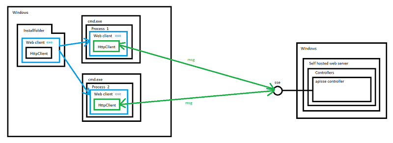

# SseExample
Example to demonstrate a test case with a problem when using sse technology

# Test case of the problem
1) publish client and server applications
2) deploy the client's sse console application, in a folder for example C:\MS\SSE\client
3) run the server application in visual studio
4) start two cmd.exe processes and in these processes run the client's console application C:\MS\SSE\client\Client.exe one after another
5) sooner or later both clients will stop at the waiting step because the following will happen
- actual behavior: At some point only one of the clients receives messages for itself and for the other client, while the other client does not receive the messages it expects and remains in the waiting state forever. And vice versa. This leads both clients to the blocking state.
- expected behavior: each client's console application receives all server event messages, selects those from them by eventId that relate to its session, processes them and waits for the next events.

# Conclusion
The area of ​​acceptable use of the technology is to launch no more than one process with an SSE client on the windows computer, to exclude cases of work in different processes of clients accessing the same SSE server URL.
